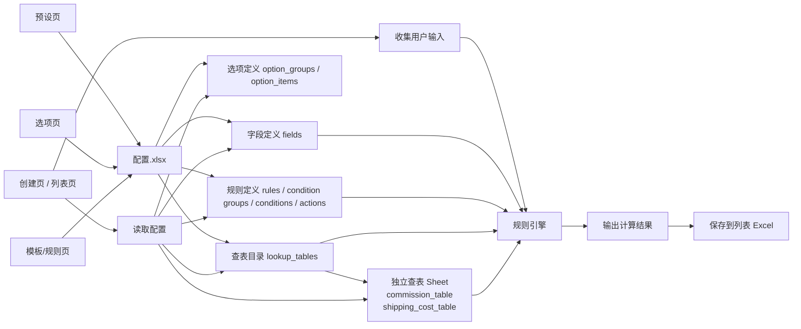
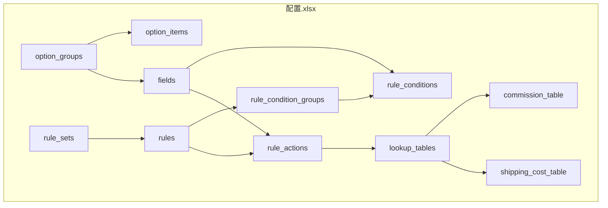
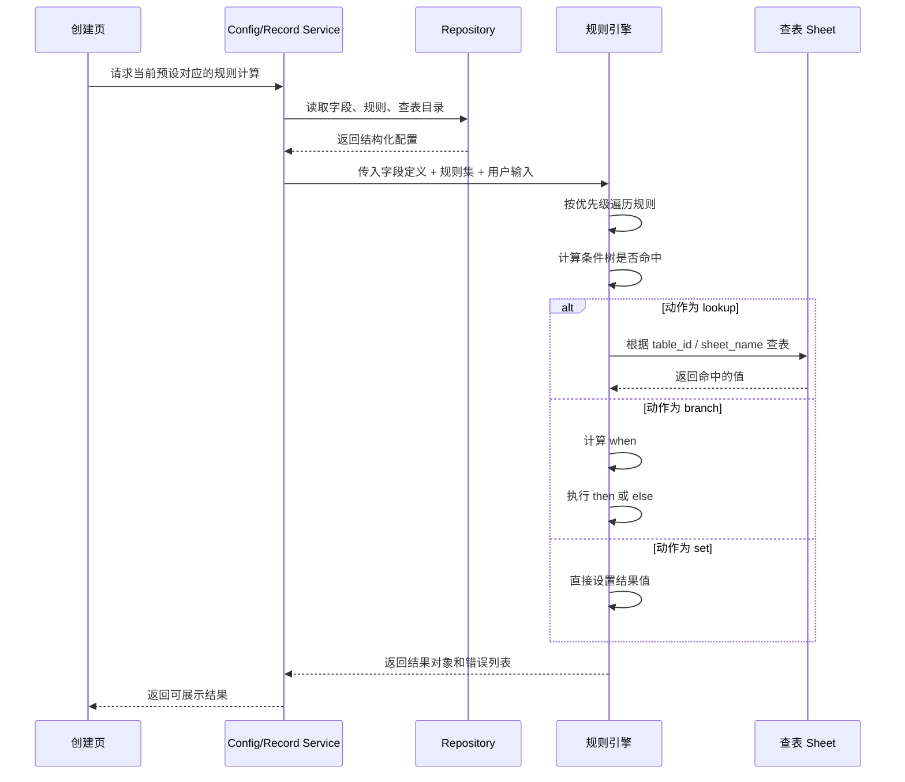
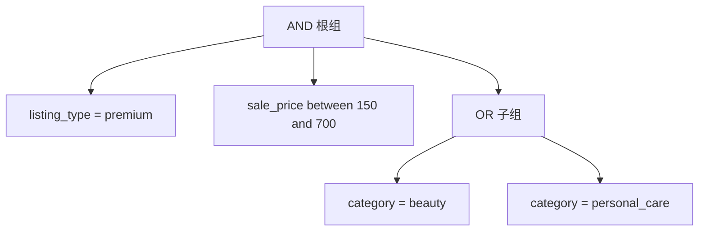
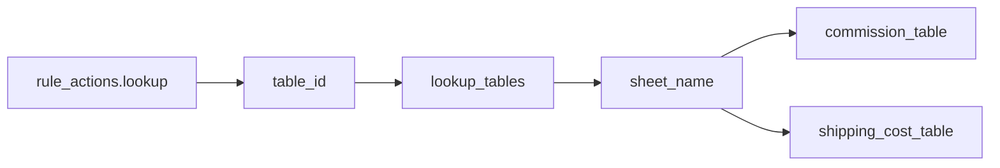

# Excel 规则驱动架构图

这份文档配合下面两个文件一起看：

1. `docs/excel-rule-example-guide.md`
2. `public/examples/excel-rule-engine-example.xlsx`

如果你想先抓整体，先看这份文档。它主要解决 4 个问题：

1. Excel 在整个系统里扮演什么角色
2. 一个工作簿里各个 sheet 是怎么协作的
3. 一次规则计算是按什么顺序执行的
4. 查表为什么要拆成独立 sheet

## 为什么这里同时用流程图和时序图

我建议你这样看：

1. 流程图：看结构和方向
2. 时序图：看一次计算到底怎么跑

原因很简单：

1. 只看流程图，容易知道“有什么”，但不清楚“先后顺序”
2. 只看时序图，容易知道“怎么跑”，但不清楚“整体边界”

所以这里两种图都会用。

## 总览流程

先看这张图，建立一句话理解：

Excel 定义字段、选项、规则和查表数据；页面只收集输入；引擎只负责解释执行。

## 工作簿结构

这张图重点看“Excel 内部关系”。

注意这里分成 4 层：

1. 字段层
2. 规则层
3. 动作层
4. 查表层

这张图表达的是：

1. `fields` 负责定义当前业务有哪些字段
2. `option_groups / option_items` 给 `select` 字段提供候选值
3. `rules + groups + conditions` 负责描述“什么时候命中”
4. `rule_actions` 负责描述“命中后做什么”
5. `lookup_tables` 只是目录，真正的数据在独立 sheet 里

## 页面和引擎边界

这张图重点看“页面不直接处理业务规则”。

这里最重要的约束是：

1. 页面不自己拼规则
2. 页面不自己查 Excel
3. 页面只负责输入和展示
4. 引擎只负责执行通用规则结构

## 一次规则计算的时序

这张图最适合看“点击一次计算按钮，到底发生了什么”。

这个顺序里有两个重点：

1. `Repository` 先把 Excel 转成结构化对象
2. `Engine` 执行的是结构化对象，不是直接操作原始单元格

## 条件树怎么理解

你前面已经确认要支持“条件树嵌套”，所以这里单独画一张图。

示例业务：

1. `listing_type = premium`
2. `sale_price` 在 `150 ~ 700`
3. `category = beauty or personal_care`

这张图对应 Excel 里的关系是：

1. `rules` 里有一条规则头
2. `rule_condition_groups` 里有根组和子组
3. `rule_conditions` 里挂具体条件

也就是说，嵌套不是靠写代码嵌套，而是靠表关系表达。

## 查表为什么要拆独立 sheet

你前面提的这个方向是对的：

`lookup_tables` 只做目录，真正数据放独立 sheet，会比所有查表混在一张总表里更好。

这么做的好处：

1. 每张查表可以有自己的列结构
2. Excel 维护时更接近人工思维
3. 新增复杂查表时，不需要污染一个总表
4. 引擎仍然可以通过 `lookup_tables` 保持统一入口

## 3 个示例怎么落到图里

### 例子 1：销售费率

适合：

1. `lookup`
2. 等值匹配
3. 独立 sheet：`commission_table`

理解方式：

1. 输入 `listing_type`
2. 输入 `category`
3. 去 `commission_table` 命中一行
4. 输出 `commission_rate`

### 例子 2：运费

适合：

1. `lookup`
2. 区间匹配
3. 独立 sheet：`shipping_cost_table`

理解方式：

1. 输入 `sale_price`
2. 输入 `shipping_weight`
3. 去 `shipping_cost_table` 找区间
4. 输出 `shipping_fee`

### 例子 3：卖家支付运费

适合：

1. `branch`
2. `then = set`
3. `else = lookup`

理解方式：

1. 如果 `is_free_shipping = true`
2. 直接输出 `0`
3. 否则去 `shipping_cost_table` 查值

## 阅读顺序建议

如果你是第一次看这套结构，建议按下面顺序：

1. 先看“总览流程”
2. 再看“工作簿结构”
3. 再看“条件树怎么理解”
4. 再看“一次规则计算的时序”
5. 最后打开 `excel-rule-engine-example.xlsx` 对照看具体 sheet

## 最后记一句话

这个项目里最核心的不是“写很多公式”，而是：

1. Excel 定义字段
2. Excel 定义规则
3. Excel 定义查表数据
4. 代码只做解释器

只要一直守住这 4 点，后面规则再复杂，也优先扩 Excel 结构，不优先扩业务硬编码。
