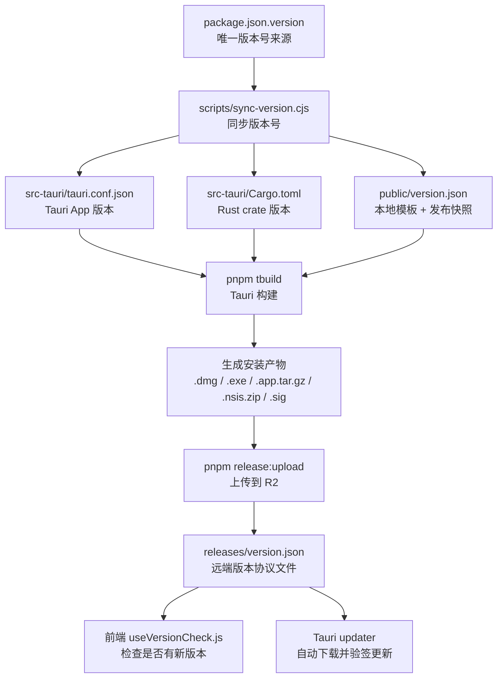
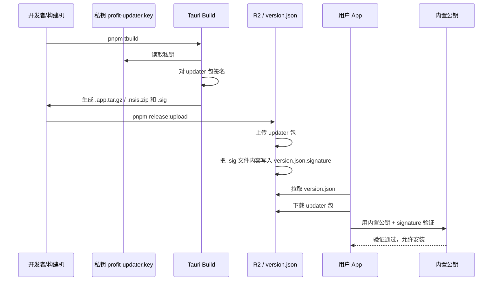
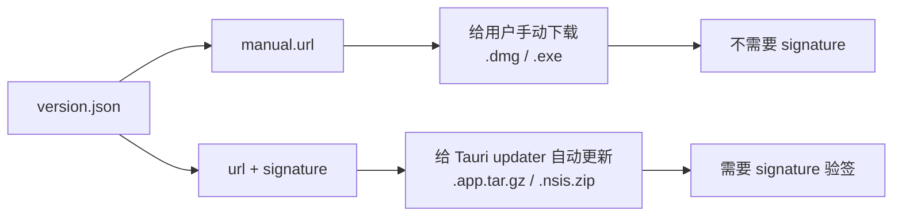
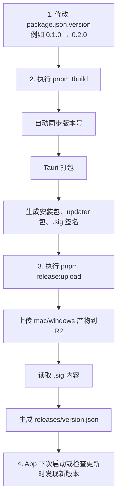

这份文档本质上是在讲 **Profit App 如何从"改版本号"一路发布到"用户自动更新"**。核心可以记成一句话：

**`package.json.version` 是版本号源头；构建时同步版本并签名；发布时上传安装包和 `releases/version.json`；App 通过远端 `releases/version.json` 判断和执行更新。** 

---

## 1. 总流程图



---

## 2. 可以这样理解每个角色

| 角色                          | 你可以理解成 | 作用                                   |
| --------------------------- | ------ | ------------------------------------ |
| `package.json.version`      | 总开关    | 所有版本号都从这里来                           |
| `sync-version.cjs`          | 抄写员    | 把版本号同步到 Tauri、Rust、public/version.json |
| `public/version.json`       | 本地模板   | 协议框架 + 最后一次发布生成的结果快照，不再提交到 Git（若加入 .gitignore）；运行时 App 不读它，读远端 releases/version.json |
| `pnpm tbuild`               | 打包机    | 构建 App，并生成 updater 包和签名              |
| 私钥 `profit-updater.key`     | 官方印章   | 用来给更新包签名，不能提交                        |
| 公钥 `profit-updater.key.pub` | 验章工具   | 内置进 App，用来验证更新包是不是官方的                |
| `.sig` 文件                   | 签名文本   | 发布时要把它的内容写入 `version.json`           |
| `release-upload.cjs`        | 发布机器人  | 上传产物到 R2，并生成远端 `version.json`        |
| 远端 `version.json`           | 更新公告板  | App 和 updater 都看它判断是否更新              |

---

## 3. 签名流程图



最容易踩坑的是这里：

```json
{
  "signature": "dW50cnVzdGVk..."
}
```

这里的 `signature` 必须是 **`.sig` 文件里的文本内容**，不是 `.sig` 文件的 URL。

错误示例：

```json
{
  "signature": "https://.../profit.app.tar.gz.sig"
}
```

因为 Tauri updater 不会自己去下载这个 URL，它会直接把这个字符串当签名解析，所以会报类似 `Invalid symbol 58` 的错误。

---

## 4. `manual.url` 和 `url` 的区别



可以简单记：

| 字段           | 给谁用         | 文件类型                        | 是否需要签名 |
| ------------ | ----------- | --------------------------- | ------ |
| `manual.url` | 用户点击下载按钮    | `.dmg` / `.exe`             | 不需要    |
| `url`        | Tauri 自动更新器 | `.app.tar.gz` / `.nsis.zip` | 需要     |
| `signature`  | Tauri 自动更新器 | `.sig` 内容                   | 必须     |

---

## 5. 发布时真正要做的事



---

## 6. 最核心的心智模型

你可以把整个系统想成这样：

```text
package.json.version
        ↓
“我要发布哪个版本？”

pnpm tbuild
        ↓
“把 App 打出来，并用私钥盖章”

pnpm release:upload
        ↓
“把安装包、updater 包、签名和 version.json 放到服务器”

App / Tauri updater
        ↓
“读取 version.json，发现新版本，下载 updater 包，用公钥验签，通过后安装”
```

---

## 7. 一句话总结

这套链路解决的是三个问题：

1. **版本号一致**：所有地方都从 `package.json.version` 同步，避免手改出错。
2. **更新包可信**：用私钥签名，App 内置公钥验签，防止包被篡改。
3. **发布自动化**：`pnpm tbuild` 负责构建签名，`pnpm release:upload` 负责上传和生成远端 `version.json`。
